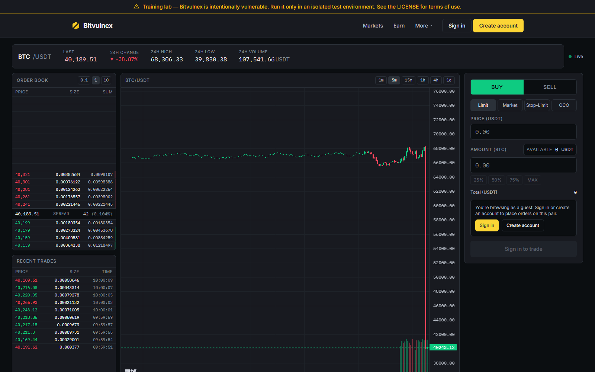
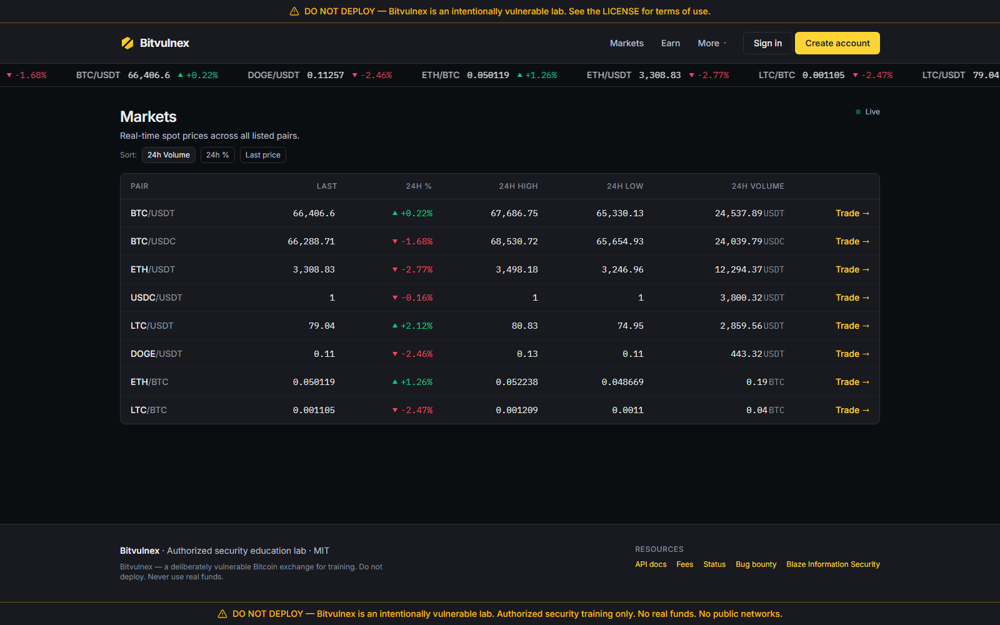
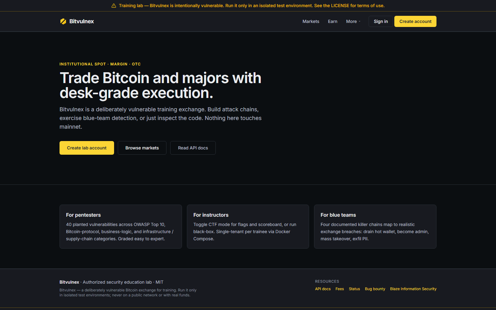

# Bitvulnex — Vulnerable Bitcoin Exchange

> ⚠️ **For isolated test environments only.** Bitvulnex is a deliberately
> vulnerable application built by [Blaze Information Security](https://www.blazeinfosec.com/)
> for security education and training. The security flaws are *intentional*,
> so treat any running instance as hostile: run it on a local machine or an
> isolated lab network, keep it off the public internet and away from
> untrusted users, and never point it at real funds, real keys, or real
> personal data. See [LICENSE](./LICENSE).

Bitvulnex is a realistic, modern Bitcoin exchange — signup, KYC, deposits,
spot trading, margin, lending/staking, OTC, P2P, withdrawals, treasury,
admin, and a support desk — seeded with **40 planted vulnerabilities**.
The flaws span the OWASP Top 10, Bitcoin-protocol and crypto-finance bugs,
business-logic abuse, and infrastructure / supply-chain weaknesses, and are
drawn from real exchange incidents (Mt. Gox, Bitfinex, FTX, Coincheck) and
real CVE shapes (e.g. the Next.js middleware bypass, HTTP request smuggling).

Every flaw is embedded in plausible business code — no `// VULN HERE`
signposting — so the app reads like something a normal, slightly careless
team shipped. The full catalog (root cause, exploitation path, and the fix a
blue team would apply) lives in [`VULNS.md`](./VULNS.md).

## Screenshots

The exchange looks and behaves like a real trading venue — that realism is the
point. The vulnerabilities hide in ordinary-looking business code, not behind
warning signs.


*Spot trading: live order book, candlestick chart, and Limit / Market / Stop-Limit / OCO order entry.*


*Markets: real-time prices, 24h stats, and volume across every listed pair.*


*Landing page — with the training-lab warning banner every entry point carries.*

## Audience

- Pentester / red-team upskilling
- Capture-the-Flag exercises (CTF mode toggleable per cohort)
- Blue-team detection and incident-response practice
- Security research in isolated labs

## Status

**Feature-complete.** All planned phases have shipped through the four-gate
workflow in [`CLAUDE.md`](./CLAUDE.md). The lab contains **40 planted
vulnerabilities** (catalog: [`VULNS.md`](./VULNS.md)) and **4 end-to-end
"killer chains"** — all verified exploitable against a live stack
(receipts: [`docs/exploitation/`](./docs/exploitation/)).

The four chains are: drain the hot wallet, become admin and persist, take
over user accounts en masse, and exfiltrate the user database and KYC
documents. How to get there is up to you.

> **Spoiler warning.** `VULNS.md`, `docs/instructor-manual/`,
> `docs/exploitation/`, `docs/hints/`, and the compiled hint and flag
> files in `docs/` are the answer key. If you're a trainee, don't read
> them.

## Where to run it

Bitvulnex is meant to be run — just in the right place. Good homes are a local
developer machine, a disposable VM, an isolated lab or CTF network, or a
private internal training host. Because every instance is intentionally
exploitable, keep it off the public internet and away from untrusted users,
run it against mock/regtest services only (the stack ships them), and never
connect it to real funds, real keys, or real personal data. Treat a running
instance the way you would any known-vulnerable target.

## Quick start

Requirements: Docker with Compose v2 (Docker Desktop on Windows/macOS,
Docker Engine on Linux), about 4 GB of free RAM, and port 80 free on the
host. Node 22 + pnpm 9 are only needed for unit tests and the instructor
scripts (`make install` sets them up).

```bash
cp .env.example .env           # required — compose refuses to start without CTF_SALT
docker compose up -d --build   # or `make up`; the first build takes a few minutes
```

The one-shot `db-migrate` container applies migrations, seeds ~54 synthetic
users, and exits. Then open <http://localhost/> in a browser. To check the
stack from a terminal:

```bash
docker compose ps -a              # db-migrate should show "Exited (0)"
curl http://localhost/api/health  # {"status":"ok","phase":0}
```

Everything comes up self-contained — the seed runs automatically as part of
`make up`. Useful URLs once the stack is healthy:

- `http://localhost/` — landing page (with the training-lab warning banner)
- `http://localhost/about/changelog` — in-app changelog
- `http://localhost/docs` — public API documentation (Swagger)
- `http://localhost/api/health` — health check (`{"status":"ok","phase":0}`)

To start, sign up for an ordinary customer account at
`http://localhost/signup`. Instructors can find the seeded staff accounts in
[`docs/instructor-manual/README.md`](./docs/instructor-manual/README.md#seeded-accounts).

(URLs assume the default `WEB_PORT=80`. If you set another host port in
`.env` — e.g. `WEB_PORT=8080` when 80 is taken — use `http://localhost:8080/`.)

Stop, re-seed, reset, or update the lab:

```bash
docker compose down                           # stop, keep data        (make down)
docker compose run --rm db-migrate            # re-run migrations+seed (make seed)
                                              # idempotent — won't rotate an
                                              # already-seeded password; use reset
                                              # for a clean slate
docker compose down -v && docker compose up -d --build   # pristine state (make reset)
git pull && docker compose up -d --build --renew-anon-volumes  # update (make up)
```

### Configuration

Compose reads a handful of toggles from `.env`; everything else is wired in
`docker-compose.yml`. After editing `.env`, run `docker compose up -d` again
so the containers pick up the change.

| Variable | Default | Purpose |
|----------|---------|---------|
| `CTF_SALT` | `change-me-per-cohort` | Required. Flags derive from it; rotate per cohort (8+ chars). |
| `CTF_MODE` / `HINT_MODE` / `SCOREBOARD_ENABLED` | `false` | Turn on the CTF surfaces. |
| `WEB_PORT` | `80` | Host port for the nginx edge. |
| `WEB_API_REPLICAS` | `5` | API-tier `next dev` processes behind nginx. Lower it (e.g. `1`) on a memory-tight host. |
| `WEB_NODE_HEAP_MB` | `2048` | V8 heap cap per web container (MB). |
| `COMPOSE_PROFILES` | `watchdog` | Leave `watchdog` on to auto-heal a V-34-poisoned API replica; clear it to observe the raw effect. |
| `ACTIVITY_SIM_ENABLED` / `ACTIVITY_SIM_EVERY_MS` | `true` / `20000` | Ambient simulated customer activity. |

### Troubleshooting

- **Port 80 already in use** (common on Windows with IIS or `http.sys`):
  set `WEB_PORT=8080` in `.env`, run `docker compose up -d`, and
  browse to `http://localhost:8080/`.
- **`CTF_SALT must be set`**: you skipped `cp .env.example .env`.
- **`web` never starts**: check `docker compose logs db-migrate` — the
  web container waits for migrations and seeding to succeed.
- **Windows**: use Docker Desktop with the WSL2 backend. Run the `.sh`
  scripts from Git Bash or WSL; `.gitattributes` keeps them LF.
- **No `make`**: every `make` target is a one-line wrapper — see the
  `Makefile` for the equivalent command.

## Tech stack

- **Framework:** Next.js 15 (App Router) + TypeScript, React 19, Tailwind
- **DB / ORM:** PostgreSQL + Prisma
- **Auth:** custom (intentionally weak in places) — *not* Auth.js/NextAuth
- **Background jobs:** BullMQ + Redis (deposit watch, liquidations, market
  maker, yield accrual, withdrawals)
- **Bitcoin:** simulated regtest only — a JS bitcoind RPC mock. **No mainnet
  code, ever.**
- **Edge:** nginx reverse proxy. **Containerization:** Docker Compose.

## Repository layout

```
.
├── CLAUDE.md                  # canonical workflow + hard rules
├── AGENTS.md                  # pointer for non-Claude AI agents
├── VULNS.md                   # planted-vulnerability ledger (40 entries)
├── README.md                  # this file
├── LICENSE                    # MIT (Blaze Information Security)
├── CONTRIBUTING.md            # how the 4-gate workflow operates
├── CHANGELOG.md               # mirrored at /about/changelog in-app
├── Makefile                   # thin wrapper around pnpm + docker compose
├── docker-compose.yml         # 10 services (web pages + web-api pool) + db-migrate init
├── nginx/                     # reverse proxy config (the public edge)
├── apps/
│   ├── web/                   # Next.js 15 (App Router) — the exchange
│   ├── worker/                # BullMQ worker (jobs + market-maker bot)
│   ├── ws-gateway/            # WebSocket gateway (live order book / trades)
│   ├── bitcoin-mock/          # JS bitcoind RPC simulator (own container)
│   ├── db-migrate/            # one-shot migrate + seed container
│   ├── mock-imds/             # mock cloud metadata service (SSRF target)
│   └── mock-s3/               # mock S3 (KYC bucket; SSRF pivot target)
├── packages/
│   ├── db/                    # Prisma schema + seed
│   ├── shared/                # JWT, types, shared utilities
│   └── bitcoin-rpc-types/     # RPC contract types
├── docs/
│   ├── architecture.md        # request flow + trust boundaries
│   ├── phases/phase-N/         # plan, architect, adversarial, paranoid QA
│   ├── exploitation/          # live-verified PoCs + per-chain receipts
│   ├── instructor-manual/     # vuln catalog, killer chains, audit
│   └── hints/                  # per-vuln + per-chain CTF hints
└── scripts/                   # seed framework, reset, derive-flags, cohorts
```

## Running a CTF cohort

The exchange ships with a 44-target CTF mode (40 planted vulnerabilities
+ 4 killer-chain bonus flags). Set `CTF_MODE=true` in `.env`, then run
`docker compose up -d` to recreate the containers, and the trainee-facing
surfaces appear:

- **`/ctf`** — trainee page. Lists every target, accepts
  `{BLAZE_BITVULNEX_...}` flag submissions, tracks per-trainee score,
  exposes an optional
  two-tier hint system (basic = category-only, verbose = lens + category,
  time-locked per the cohort's `verboseUnlockSeconds`).
- **`/admin/ctf`** — instructor console (reach by typing the URL; not
  linked from the public navbar). Create/archive/reset cohorts, toggle
  hint defaults, edit verbose-unlock windows, view per-trainee scoreboard
  + per-target reveal heat map, CSV export, instructor reveal-flag
  override (audit-logged).

### Per-cohort workflow

1. Spin up an isolated cohort: rotate `CTF_SALT` and run
   `scripts/new-cohort.sh <cohort-name> [--hints=on|off]`. The script
   logs in as admin, creates the cohort, and prints the 44-flag table
   (save to an instructor-private file — do NOT share with trainees).
   It needs `bash`, `curl`, and host Node/pnpm (`make install`); on
   Windows, run it from Git Bash or WSL. It reads `CTF_SALT` from your
   shell, falling back to `.env`.
2. Trainees sign up on the running stack. They auto-attach to the
   `default` cohort on first `/ctf` interaction. Move them to your
   real cohort by editing `User.cohortId` directly, OR (recommended)
   spin up a separate `docker compose` project per cohort with a
   different `CTF_SALT` and isolated DB.
3. During the exercise, monitor `/admin/ctf` → scoreboard for progress.
   The heat map highlights targets with high reveal counts as
   `warn` — useful for spotting "everyone's stuck on V-22, need to
   rephrase the hint" patterns.
4. At session end, archive the cohort (`PATCH /api/v2/admin/ctf/cohorts/<id>
   {archived:true}`). CSV-export the scoreboard for cohort post-mortem.
5. **Reset semantics**: `POST /api/v2/admin/ctf/cohorts/<id>/reset` drops
   all submissions, interactions, and hint reveals for the cohort
   (audit-logged). The cohort row itself stays so historical pointers
   remain valid.

### Flag delivery patterns

Three patterns, used per the vuln's natural exploit shape:

- **Pattern A — inline emission.** The vuln's exploit-condition is
  server-side detectable; the response includes
  `_flag: {BLAZE_BITVULNEX_...}`.
  Used by V-4, V-22, V-25, V-40, V-46, V-47, V-51 (more wiring tracked
  in `docs/phases/phase-11/slice-2x-todo.md`).
- **Pattern B — claim endpoint.** `POST /api/v2/ctf/claim` with
  `{vulnId, proof}`. Validator checks the proof's shape (a polyglot
  envelope, a smuggled HTTP frame, an SQLi payload, etc.) and returns
  the flag if it matches.
- **Pattern C — self-derivable.** The trainee discovers a static
  secret (`changeme`, `.env.bak` contents, a CVE id, a private-scope
  package name) and submits it as the proof. The flag is deterministic
  in (vulnId, secret) and does NOT involve `CTF_SALT` — the same secret
  yields the same flag across cohorts because the secret IS the
  static codebase. Pattern C plants: V-9, V-15, V-48, V-49.

The 4 killer-chain flags pay 5× a single-vuln flag in the scoreboard
weight; each requires multi-step composite proof submitted to the
claim endpoint.

### Hint authoring

Hints live in `docs/hints/V-NNN.md` (plants) and `docs/hints/CHAIN-X.md`
(chains, multi-step). Format:

```markdown
---
target: V-22
category: OWASP / Mass assignment
tier-1-basic: |
  Category-only nudge (≤ 200 chars, no file paths).
tier-2-verbose: |
  Lens + category guidance (≤ 600 chars, no file paths or payloads).
---
```

The depth-ceiling validator runs in CI (`apps/web/lib/ctf/__tests__/
hints.test.ts`) — malformed front-matter fails `pnpm -w run test`. After
editing hints in the docker dev stack, hit `POST /api/v2/admin/ctf/
reload-hints` to clear the in-process cache without restarting the web
container.

## Workflow

Every phase of development passes four sign-off gates (Senior Architect
→ Staff Engineer → Adversarial QA → Paranoid QA) before any commit.
See [`CLAUDE.md`](./CLAUDE.md) for the full process and
[`docs/phases/`](./docs/phases/) for per-phase artifacts.

## Reporting a real bug

If you find a vulnerability that is **not** documented in `VULNS.md`,
that's an unintended bug — please open an issue. If it *is* in
`VULNS.md`, that's a feature, not a bug. 🙂

## License

[MIT](./LICENSE) © Blaze Information Security & the Bitvulnex contributors.
Forks for training use are encouraged. Bitvulnex is deliberately vulnerable, so
run it only in isolated test environments — keep the in-app warning banner, and
never expose an instance to the public internet or point it at real funds, keys,
or personal data.
